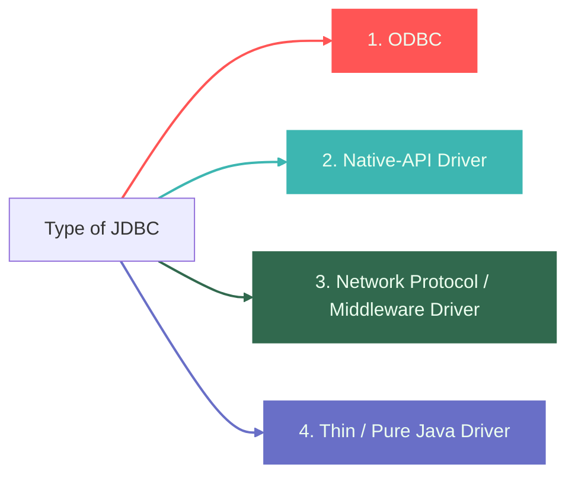
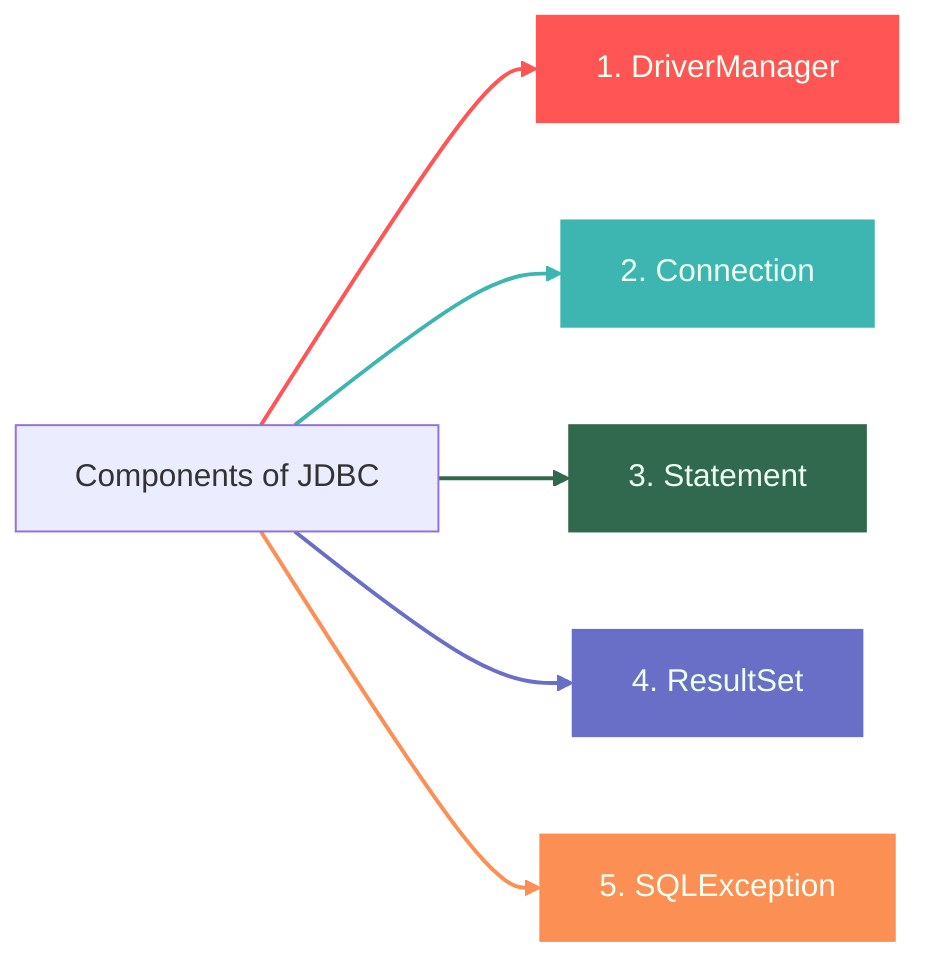
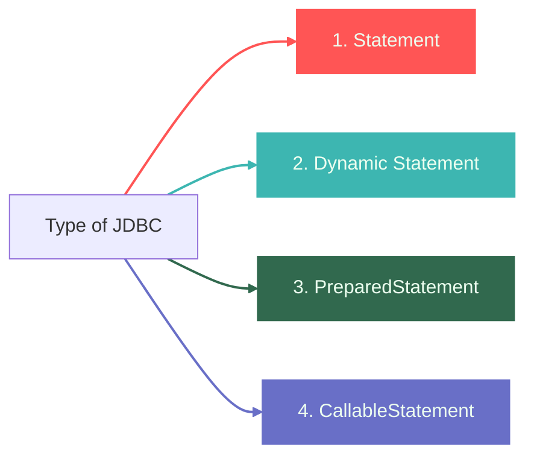
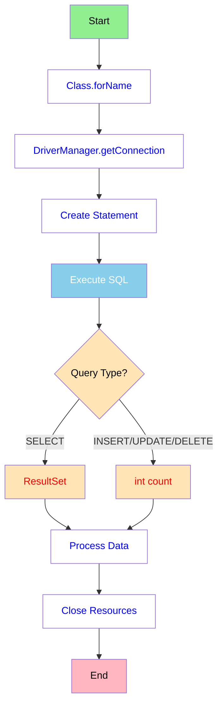

---

## 1️⃣ What is JDBC?
##### JDBC = Java Database Connectivity

JDBC is a ***Java API*** that enables Java applications to interact with databases. 
It provides a standard set of classes and interfaces to connect to databases, execute SQL queries, and process the results.

> #### ***Simple Explanation***
> Think of JDBC as a **bridge between your Java application and a database** (like MySQL, Oracle, PostgreSQL, etc.).

| ❌ Without JDBC| ✅ With JDBC|
|------------|---------|
|Your Java program cannot talk to databases| Your Java program can store, retrieve, update, and delete data from databases|

---

## 2️⃣ Why Do We Need JDBC?
- Java alone **cannot communicate** with databases.  
- JDBC provides a **standard way** to connect Java applications with any database (MySQL, Oracle, PostgreSQL, etc.).  
- Helps perform **CRUD operations** (Create, Read, Update, Delete).  
- Makes data handling **easy and secure**.  
- Provides **drivers** that convert Java calls into database-specific commands.  
- Ensures **database independence** — same Java code can work with different databases.  
- Allows execution of SQL queries, stored procedures, and transaction management.
- Essential for enterprise applications like billing systems, ERPs, CRMs, hospital management apps, etc.
- Helps in building dynamic, data-driven applications.
- Makes real-time applications (banking, e-commerce) possible by connecting with live databases.

---

## 3️⃣ Importance of JDBC

- Enables **communication between Java and databases**.
- Works with **all major relational databases**.
- Provides **platform-independent** database operations.
- Supports **batch processing**, improving performance.
- Allows calling **Stored Procedures** using CallableStatement.
- Helps build **enterprise-level applications**.
- Ensures **data security** with prepared statements.
- Easy to use and widely supported in Java development.
- Reduces development effort by offering **standard APIs**.
- Plays a key role in **web applications, desktop apps, and enterprise systems**.

---

## 4️⃣ Features of JDBC
JDBC (Java Database Connectivity) provides a standard API for connecting Java applications to relational databases. Below are its key features:

🔹 **1. Platform Independent**
- Written entirely in Java.
- Works on any OS that supports Java.

🔹 **2. Database Independent (Vendor Neutral)**
- Same code works with multiple databases.
- Only the JDBC driver needs to change.

🔹 **3. Supports Multiple Driver Types**
- Type 1, Type 2, Type 3, Type 4 drivers.
- Modern systems prefer Type 4 (Pure Java).

🔹 **4. Standard API**
JDBC provides a set of common interfaces:
- `Connection`
- `Statement`
- `PreparedStatement`
- `CallableStatement`
- `ResultSet`

🔹 **5. Supports All SQL Operations**
- CRUD: Create, Read, Update, Delete  
- DDL: CREATE, ALTER, DROP  
- DCL/TCL: COMMIT, ROLLBACK, GRANT  

🔹 **6. PreparedStatement Support**
- Prevents SQL Injection.  
- Precompiled → better performance.

🔹 **7. CallableStatement Support**
- Executes stored procedures and functions in the database.

🔹 **8. Transaction Management**
- Manual commit/rollback.
- Control using:
  - `setAutoCommit(false)`
  - `commit()`
  - `rollback()`

🔹 **9. Batch Processing**
- Execute multiple SQL statements as a batch.
- Improves speed for bulk operations.

🔹 **10. Metadata Access**
- `DatabaseMetaData` → database information.  
- `ResultSetMetaData` → column info of result sets.

🔹 **11. Supports Large Objects (LOBs)**
- BLOB (Binary Large Object)  
- CLOB (Character Large Object)  

🔹 **12. Strong Exception Handling**
- SQLException provides:
  - SQLState  
  - Error code  
  - Error message  

🔹 **13. Supports Connection Pooling**
- Integrates with:
  - HikariCP  
  - Apache DBCP  
  - C3P0  
- Improves performance & scalability.

🔹 **14. Secure and Portable**
- Java security model.
- Works across all platforms without modification.

---

## 5️⃣ Benefits of JDBC

- Makes **communication** between Java applications and databases possible.
- Provides a **standard API** for accessing different relational databases.
- Works with almost all major databases: **MySQL**, **Oracle**, **PostgreSQL**, **SQL Server**, etc.
- Allows developers to perform **CRUD operations** easily (**Create**, **Read**, **Update**, **Delete**).
- Supports both **dynamic** (`PreparedStatement`) and **callable SQL** (`CallableStatement` for stored procedures).
- Offers strong **exception handling** using `SQLException`.
- Ensures **secure query execution** using `PreparedStatement` to prevent **SQL Injection**.
- **Platform-independent** because JDBC is part of Java's **"write once, run anywhere"** nature.
- Supports **connection pooling** for better performance in large applications.
- Provides **metadata access** (`DatabaseMetaData`, `ResultSetMetaData`) to understand DB structure at runtime.
- Enables **batch execution** to speed up multiple queries.
- Helps integrate **enterprise applications** with backend databases efficiently.
- Fully supported in all **Java IDEs** and frameworks (**Spring**, **Hibernate** build on it internally).

--- 

## 6️⃣Types of JDBC

| **Type** | **How it Works** | **Pros** | **Cons** | **Example** |
|:------:|:------------------------------:|:------------------------------:|:------------------------------:|:------------------:|
| **1** | JDBC → ODBC Bridge → Database | Easy to use, no DB-specific drivers needed | Very slow, requires ODBC installation, obsolete | JDBC-ODBC Bridge |
| **2** | JDBC → Native API → Database | Faster than Type 1 | Database-specific, requires native libraries | Oracle OCI |
| **3** | JDBC → Middleware Server → Database | Database-independent, portable | Requires middleware server | SequeLink |
| **4** | JDBC → Database (Pure Java) | Fastest, portable, no native libraries, widely used | None major, depends on DB-specific driver | MySQL Connector/J, PostgreSQL Driver |

---

## 7️⃣ JDBC 2-tier Architecture v/s 3-tier Architecture

#### 2 Tier Architecture (Technical)

#### 2 Tier Architecture (Non-Technical)

#### 3 Tier Architecture (Technical)

#### 3 Tier Architecture (Non-Technical)

| Feature | Two-Tier Database Architecture | Three-Tier Database Architecture |
|---------|-------------------------------|---------------------------------|
| Type | Client-Server Architecture | Web-based Application |
| Application Logic | Buried inside client UI or database server (or both) | Resides in middle-tier, separated from data and UI |
| Layers | Client Tier and Database (Data Tier) | Client Layer, Business Layer, and Data Layer |
| Complexity | Easy to build and maintain | Complex to build and maintain |
| Performance | Runs slower | Runs faster |
| Security | Less secure (client communicates directly with DB) | More secure (client cannot access DB directly) |
| Scalability | Performance loss as users increase | Better performance on Internet-based systems |
| Example | Contact Management System using MS-Access, Railway Reservation System | Online registration forms, large websites |

---

## 8️⃣Components

| Component         | Description / Role                                                                 | Example Usage |
|------------------|-----------------------------------------------------------------------------------|---------------|
| **DriverManager** | Manages a list of database drivers and establishes a connection to the database. | `DriverManager.getConnection(url, user, password)` |
| **Connection**    | Represents a connection to a specific database; used to create Statement, PreparedStatement, or CallableStatement objects. | `Connection con = DriverManager.getConnection(...)` |
| **Statement**     | Used to send SQL queries to the database.  **Types:**  - Statement: simple queries  - PreparedStatement: parameterized, precompiled, safer  - CallableStatement: execute stored procedures | `Statement stmt = con.createStatement();` |
| **ResultSet**     | Holds data retrieved from a query; acts like a table in memory.                  | `ResultSet rs = stmt.executeQuery("SELECT * FROM students");` |
| **SQLException**  | Handles errors or exceptions related to database access; used in try-catch blocks. | `try { /* DB code */ } catch(SQLException e) { e.printStackTrace(); }` |

---
## 8️️⃣ Types of statements

| Type                  | SQL Input            | Safe?       | Performance | Best For                  |
| --------------------- | -------------------- | ----------- | ----------- | ------------------------- |
| **Statement**         | Static               | ❌ Not safe  | Slow        | Simple fixed queries      |
| **Dynamic Statement** | Concatenated strings | ❌ Dangerous | Slow        | Old style dynamic queries |
| **PreparedStatement** | Uses `?`             | ✔ Safe      | Fast        | Queries with user inputs  |
| **CallableStatement** | Stored Procedures    | ✔ Safe      | Very Fast   | Complex DB operations     |

---
### Program Flow

