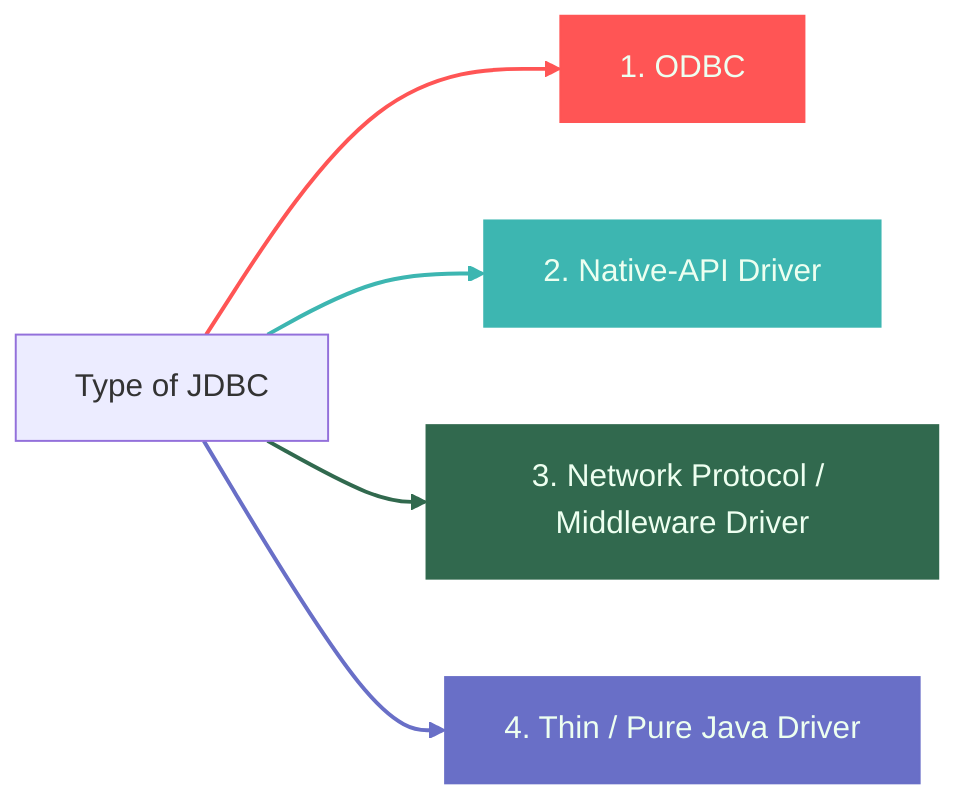
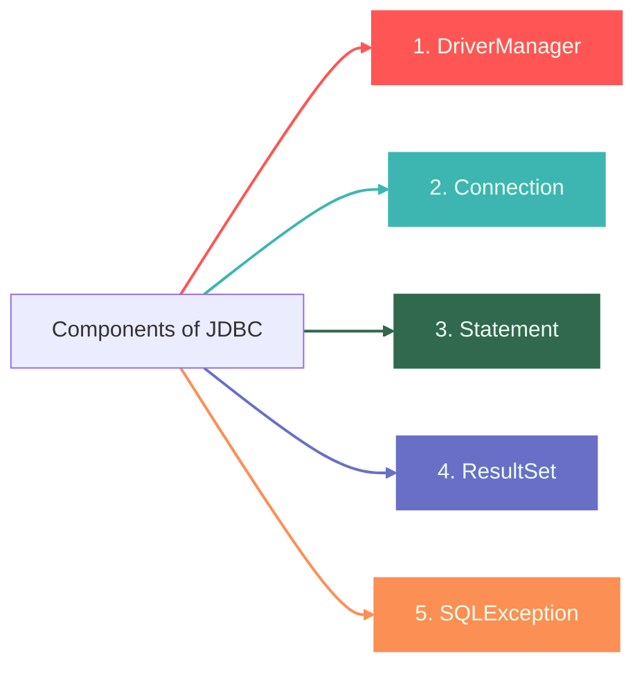
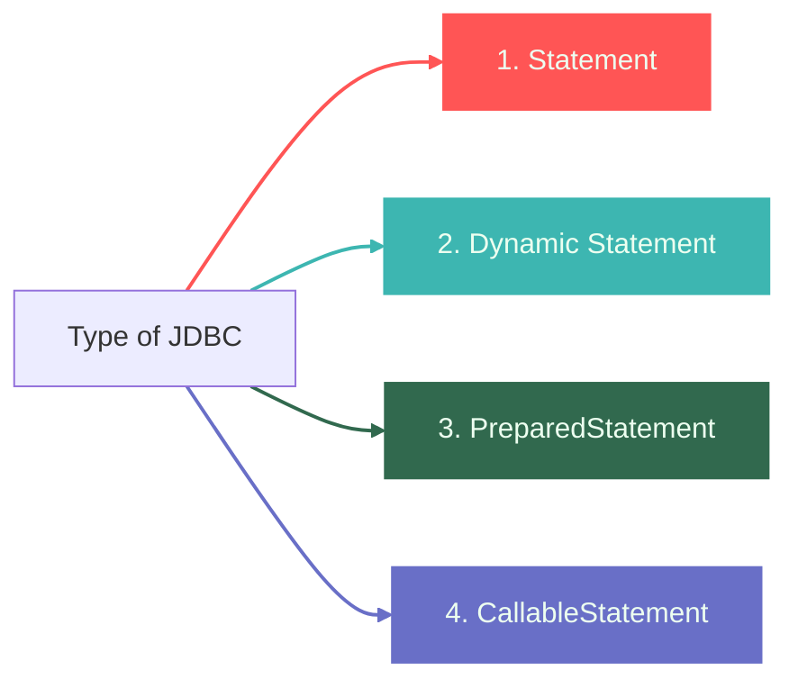
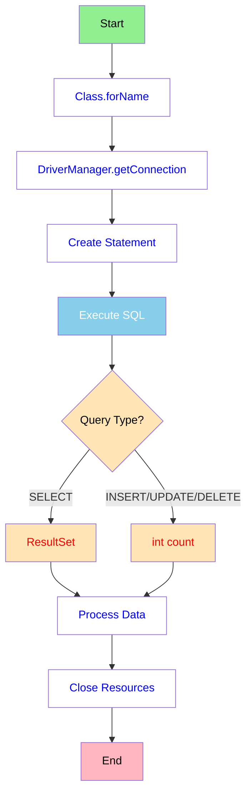

# JDBC 


---

## 1️⃣ What is JDBC?
##### JDBC = Java Database Connectivity


JDBC is a ***Java API*** that enables Java applications to interact with databases. 
It provides a standard set of classes and interfaces to connect to databases, execute SQL queries, and process the results.

> #### ***Simple Explanation***
> Think of JDBC as a **bridge between your Java application and a database** (like MySQL, Oracle, PostgreSQL, etc.).

| ❌ Without JDBC| ✅ With JDBC|
|------------|---------|
|Your Java program cannot talk to databases| Your Java program can store, retrieve, update, and delete data from databases|

---

## 2️⃣ Why Do We Need JDBC?
- Java alone **cannot communicate** with databases.  
- JDBC provides a **standard way** to connect Java applications with any database (MySQL, Oracle, PostgreSQL, etc.).  
- Helps perform **CRUD operations** (Create, Read, Update, Delete).  
- Makes data handling **easy and secure**.  
- Provides **drivers** that convert Java calls into database-specific commands.  
- Ensures **database independence** — same Java code can work with different databases.  
- Allows execution of SQL queries, stored procedures, and transaction management.
- Essential for enterprise applications like billing systems, ERPs, CRMs, hospital management apps, etc.
- Helps in building dynamic, data-driven applications.
- Makes real-time applications (banking, e-commerce) possible by connecting with live databases.

---

## 3️⃣ Importance of JDBC

- Enables **communication between Java and databases**.
- Works with **all major relational databases**.
- Provides **platform-independent** database operations.
- Supports **batch processing**, improving performance.
- Allows calling **Stored Procedures** using CallableStatement.
- Helps build **enterprise-level applications**.
- Ensures **data security** with prepared statements.
- Easy to use and widely supported in Java development.
- Reduces development effort by offering **standard APIs**.
- Plays a key role in **web applications, desktop apps, and enterprise systems**.

---

## 4️⃣ Features of JDBC
JDBC (Java Database Connectivity) provides a standard API for connecting Java applications to relational databases. Below are its key features:

🔹 **1. Platform Independent**
- Written entirely in Java.
- Works on any OS that supports Java.

🔹 **2. Database Independent (Vendor Neutral)**
- Same code works with multiple databases.
- Only the JDBC driver needs to change.

🔹 **3. Supports Multiple Driver Types**
- Type 1, Type 2, Type 3, Type 4 drivers.

🔹 **4. Standard API**
JDBC provides a set of common interfaces:
- `Connection`
- `Statement`
- `PreparedStatement`
- `CallableStatement`
- `ResultSet`

🔹 **5. Supports All SQL Operations**
- CRUD: Create, Read, Update, Delete  
- DDL: CREATE, ALTER, DROP  
- DCL/TCL: COMMIT, ROLLBACK, GRANT  

🔹 **6. PreparedStatement Support**
- Prevents SQL Injection.  
- Precompiled → better performance.

🔹 **7. CallableStatement Support**
- Executes stored procedures and functions in the database.

🔹 **8. Transaction Management**
- Manual commit/rollback.
- Control using:
  - `setAutoCommit(false)`
  - `commit()`
  - `rollback()`

🔹 **9. Batch Processing**
- Execute multiple SQL statements as a batch.
- Improves speed for bulk operations.

🔹 **10. Metadata Access**
- `DatabaseMetaData` → database information.  
- `ResultSetMetaData` → column info of result sets.

🔹 **11. Supports Large Objects (LOBs)**
- BLOB (Binary Large Object)  
- CLOB (Character Large Object)  

🔹 **12. Strong Exception Handling**
- SQLException provides:
  - SQLState  
  - Error code  
  - Error message  

🔹 **13. Supports Connection Pooling**
- Integrates with:
  - HikariCP  
  - Apache DBCP  
  - C3P0  
- Improves performance & scalability.

🔹 **14. Secure and Portable**
- Java security model.
- Works across all platforms without modification.

---

## 5️⃣ Benefits of JDBC

- Makes **communication** between Java applications and databases possible.
- Provides a **standard API** for accessing different relational databases.
- Works with almost all major databases: **MySQL**, **Oracle**, **PostgreSQL**, **SQL Server**, etc.
- Allows developers to perform **CRUD operations** easily (**Create**, **Read**, **Update**, **Delete**).
- Supports both **dynamic** (`PreparedStatement`) and **callable SQL** (`CallableStatement` for stored procedures).
- Offers strong **exception handling** using `SQLException`.
- Ensures **secure query execution** using `PreparedStatement` to prevent **SQL Injection**.
- **Platform-independent** because JDBC is part of Java's **"write once, run anywhere"** nature.
- Supports **connection pooling** for better performance in large applications.
- Provides **metadata access** (`DatabaseMetaData`, `ResultSetMetaData`) to understand DB structure at runtime.
- Enables **batch execution** to speed up multiple queries.
- Helps integrate **enterprise applications** with backend databases efficiently.
- Fully supported in all **Java IDEs** and frameworks (**Spring**, **Hibernate** build on it internally).

--- 

## 6️⃣Types of JDBC



| **Type** | **How it Works** | **Pros** | **Cons** | **Example** |
|:------:|:------------------------------:|:------------------------------:|:------------------------------:|:------------------:|
| **1** | JDBC → ODBC Bridge → Database | Easy to use, no DB-specific drivers needed | Very slow, requires ODBC installation, obsolete | JDBC-ODBC Bridge |
| **2** | JDBC → Native API → Database | Faster than Type 1 | Database-specific, requires native libraries | Oracle OCI |
| **3** | JDBC → Middleware Server → Database | Database-independent, portable | Requires middleware server | SequeLink |
| **4** | JDBC → Database (Pure Java) | Fastest, portable, no native libraries, widely used | None major, depends on DB-specific driver | MySQL Connector/J, PostgreSQL Driver |


---

## 7️⃣ JDBC 2-tier Architecture v/s 3-tier Architecture

#### 2 Tier Architecture (Technical)


#### 2 Tier Architecture (Non-Technical)


#### 3 Tier Architecture (Technical)


#### 3 Tier Architecture (Non-Technical)


| Feature | Two-Tier Database Architecture | Three-Tier Database Architecture |
|---------|-------------------------------|---------------------------------|
| Type | Client-Server Architecture | Web-based Application |
| Application Logic | Buried inside client UI or database server (or both) | Resides in middle-tier, separated from data and UI |
| Layers | Client Tier and Database (Data Tier) | Client Layer, Business Layer, and Data Layer |
| Complexity | Easy to build and maintain | Complex to build and maintain |
| Performance | Runs slower | Runs faster |
| Security | Less secure (client communicates directly with DB) | More secure (client cannot access DB directly) |
| Scalability | Performance loss as users increase | Better performance on Internet-based systems |
| Example | Contact Management System using MS-Access, Railway Reservation System | Online registration forms, large websites |


---

## 8️⃣Components


#### 1. DriverManager

`DriverManager` is a class that manages a set of JDBC drivers. It's the traditional way to establish a connection to a database.
```java
Class.forName("com.mysql.cj.jdbc.Driver");  // Load the JDBC driver
```

**Key Points:**
- Loads and registers the JDBC driver for MySQL
- Modern JDBC drivers (4.0+) auto-register, but explicit loading ensures compatibility
- Acts as a factory for creating `Connection` objects
- Maintains a list of registered drivers and selects the appropriate one based on the connection URL

**Methods:**
- `getConnection(String url, String user, String password)` - Establishes a database connection
- `registerDriver(Driver driver)` - Registers a driver with the DriverManager
- `getDrivers()` - Retrieves an enumeration of all loaded JDBC drivers


### 2. Connection

The `Connection` interface represents a session with the database. It's used to create statements and manage transactions.
```java
Connection con = DriverManager.getConnection(url, user, pswd);
```

**Key Points:**
- Establishes a connection to the database using URL, username, and password
- Connection URL format: `jdbc:mysql://hostname:port/database_name`
- Should be closed after use to free up resources (use try-with-resources in production)
- Supports transaction management (commit, rollback, setAutoCommit)
- Represents a physical connection to the database

**Common Methods:**
- `createStatement()` - Creates a Statement object for executing SQL queries
- `prepareStatement(String sql)` - Creates a PreparedStatement object
- `close()` - Closes the database connection
- `commit()` - Makes all changes permanent since the last commit
- `rollback()` - Undoes all changes made in the current transaction
- `setAutoCommit(boolean autoCommit)` - Sets auto-commit mode

### 3. Statement

The `Statement` interface is used to execute SQL queries against the database.
```java
Statement stmt = con.createStatement();
```

**Types of Statements:**

**a) Statement** (used in this project)
- Executes simple SQL queries without parameters
- Vulnerable to SQL injection
- Best for static queries
- SQL query is compiled every time it's executed
```java
ResultSet rs = stmt.executeQuery("SELECT * FROM employees");  // For SELECT
int rows = stmt.executeUpdate("INSERT INTO employees ...");    // For INSERT/UPDATE/DELETE
```

**Key Methods:**
- `executeQuery(String sql)` - Executes SELECT queries, returns ResultSet
- `executeUpdate(String sql)` - Executes INSERT, UPDATE, DELETE queries, returns row count
- `execute(String sql)` - Executes any SQL statement, returns boolean


### 4. ResultSet

The `ResultSet` interface represents the result of a database query. It maintains a cursor pointing to the current row of data.
```java
ResultSet rs = stmt.executeQuery("SELECT * FROM employees");
while (rs.next()) {
    int id = rs.getInt("eid");
    String name = rs.getString("ename");
    String dept = rs.getString("edept");
    double salary = rs.getDouble("esal");
}
```

**Key Points:**
- Acts as a table of data returned by executing a SELECT query
- Cursor initially positioned before the first row
- `next()` method moves cursor to the next row
- Returns `false` when no more rows are available

**Common Methods:**
- `next()` - Moves cursor to the next row, returns true if row exists
- `getInt(String columnName)` - Retrieves integer value from specified column
- `getString(String columnName)` - Retrieves string value from specified column
- `getDouble(String columnName)` - Retrieves double value from specified column
- `getBoolean()`, `getDate()`, `getTimestamp()` - Other data type retrievers
- `first()`, `last()`, `absolute(int row)` - Navigation methods (for scrollable ResultSets)
- `close()` - Closes the ResultSet

**Types of ResultSet:**
- **TYPE_FORWARD_ONLY** - Cursor moves forward only (default)
- **TYPE_SCROLL_INSENSITIVE** - Scrollable, not sensitive to changes
- **TYPE_SCROLL_SENSITIVE** - Scrollable, sensitive to database changes

### 5. SQLException

`SQLException` is an exception class that provides information about database access errors and other errors.
```java
try {
    Connection con = DriverManager.getConnection(url, user, pswd);
    // Database operations
} catch (SQLException e) {
    System.out.println("Error: " + e.getMessage());
    System.out.println("Error Code: " + e.getErrorCode());
    System.out.println("SQL State: " + e.getSQLState());
}
```

**Key Points:**
- Thrown when database access errors occur
- Provides detailed error information
- Can be chained (one exception can contain another)
- Helps in debugging database-related issues

**Common Methods:**
- `getMessage()` - Returns a description of the error
- `getErrorCode()` - Returns vendor-specific error code
- `getSQLState()` - Returns SQLState (standardized error code)
- `getNextException()` - Returns the next exception in the chain
- `printStackTrace()` - Prints stack trace for debugging

**Common SQL Error Scenarios:**
- Connection failures (wrong credentials, server down)
- Syntax errors in SQL statements
- Constraint violations (primary key, foreign key, unique)
- Table or column not found
- Data type mismatches
- Timeout errors


| Component         | Description / Role                                                                 | Example Usage |
|------------------|-----------------------------------------------------------------------------------|---------------|
| **DriverManager** | Manages a list of database drivers and establishes a connection to the database. | `DriverManager.getConnection(url, user, password)` |
| **Connection**    | Represents a connection to a specific database; used to create Statement, PreparedStatement, or CallableStatement objects. | `Connection con = DriverManager.getConnection(...)` |
| **Statement**     | Used to send SQL queries to the database. <br>**Types:** <br>- Statement: simple queries <br>- PreparedStatement: parameterized, precompiled, safer <br>- CallableStatement: execute stored procedures | `Statement stmt = con.createStatement();` |
| **ResultSet**     | Holds data retrieved from a query; acts like a table in memory.                  | `ResultSet rs = stmt.executeQuery("SELECT * FROM students");` |
| **SQLException**  | Handles errors or exceptions related to database access; used in try-catch blocks. | `try { /* DB code */ } catch(SQLException e) { e.printStackTrace(); }` |

---
## 9️⃣ Types of statements



| Type                  | SQL Input            | Safe?       | Performance | Best For                  |
| --------------------- | -------------------- | ----------- | ----------- | ------------------------- |
| **Statement**         | Static               | ❌ Not safe  | Slow        | Simple fixed queries      |
| **Dynamic Statement** | Concatenated strings | ❌ Dangerous | Slow        | Old style dynamic queries |
| **PreparedStatement** | Uses `?`             | ✔ Safe      | Fast        | Queries with user inputs  |
| **CallableStatement** | Stored Procedures    | ✔ Safe      | Very Fast   | Complex DB operations     |


---

## 🔟 Installation & Setup

### Prerequisites
- **JDK 8 or higher** installed on your system
- **IntelliJ IDEA** or **Eclipse IDE** installed
- **JDBC driver** for your database (MySQL, PostgreSQL, Oracle, etc.)
- **Database server** running (MySQL, PostgreSQL, Oracle, SQL Server, etc.)


### 📥 Step 1: Download JDBC Driver

Download the JDBC driver JAR file for your database:

| Database | Download Link |
|:----------:|:--------------:|
| **MySQL** | [MySQL Connector/J](https://dev.mysql.com/downloads/connector/j/) |
| **PostgreSQL** | [PostgreSQL JDBC Driver](https://jdbc.postgresql.org/download/) |
| **Oracle** | [Oracle JDBC Driver](https://www.oracle.com/database/technologies/appdev/jdbc-downloads.html) |
| **SQL Server** | [Microsoft JDBC Driver](https://docs.microsoft.com/en-us/sql/connect/jdbc/download-microsoft-jdbc-driver-for-sql-server) |

---

### 🛠️ Step 2A: Setup in IntelliJ IDEA

#### Method 1: Manual JAR Addition

1. Open your project in **IntelliJ IDEA**
2. Go to **File** → **Project Structure** (or press `Ctrl+Alt+Shift+S` on Windows/Linux, `Cmd+;` on Mac)
3. Select **Modules** from the left panel
4. Click on the **Dependencies** tab
5. Click the **+** button and select **JARs or directories**
6. Navigate to and select your downloaded JDBC driver JAR file
7. Click **OK** to apply changes

#### Method 2: Using Maven (Recommended)

Add the dependency to your `pom.xml`:

**For MySQL:**
```xml

    com.mysql
    mysql-connector-j
    8.2.0

```

**For PostgreSQL:**
```xml
    org.postgresql
    postgresql
    42.7.1
```

**For Oracle:**
```xml
    com.oracle.database.jdbc
    ojdbc8
    23.3.0.23.09
```

**For SQL Server:**
```xml
    com.microsoft.sqlserver
    mssql-jdbc
    12.4.2.jre11
```

#### Method 3: Using Gradle

Add to your `build.gradle`:
```gradle
dependencies {
    // MySQL
    implementation 'com.mysql:mysql-connector-j:8.2.0'
    
    // PostgreSQL
    implementation 'org.postgresql:postgresql:42.7.1'
    
    // Oracle
    implementation 'com.oracle.database.jdbc:ojdbc8:23.3.0.23.09'
    
    // SQL Server
    implementation 'com.microsoft.sqlserver:mssql-jdbc:12.4.2.jre11'
}
```

---

### 🛠️ Step 2B: Setup in Eclipse IDE

#### Method 1: Manual JAR Addition

1. Open your project in **Eclipse**
2. Right-click on your project in **Project Explorer**
3. Select **Build Path** → **Configure Build Path**
4. Click on the **Libraries** tab
5. Click **Add External JARs** (or **Add JARs** if the driver is already in your project)
6. Navigate to and select your JDBC driver JAR file
7. Click **Open**, then **Apply and Close**

#### Method 2: Using Maven

Same as IntelliJ - add dependencies to `pom.xml` as shown above.

#### Method 3: Using Gradle

Same as IntelliJ - add dependencies to `build.gradle` as shown above.

---

### ✅ Step 3: Verify Installation

Create a simple test class to verify the JDBC setup:
```java
import java.sql.Connection;
import java.sql.DriverManager;
import java.sql.SQLException;

public class JDBCTest {
    public static void main(String[] args) {
        // Database connection parameters
        String url = "jdbc:mysql://localhost:3306/your_database";
        String user = "your_username";
        String password = "your_password";
        
        Connection conn = null;
        
        try {
            // Establish connection
            conn = DriverManager.getConnection(url, user, password);
            System.out.println("✅ Connection successful!");
            System.out.println("Database: " + conn.getMetaData().getDatabaseProductName());
            System.out.println("Driver: " + conn.getMetaData().getDriverName());
            
        } catch (SQLException e) {
            System.err.println("❌ Connection failed!");
            e.printStackTrace();
        } finally {
            // Close connection
            if (conn != null) {
                try {
                    conn.close();
                    System.out.println("Connection closed.");
                } catch (SQLException e) {
                    e.printStackTrace();
                }
            }
        }
    }
}
```

---

### 🔗 Connection String Examples

Different databases require different connection strings:

#### MySQL
```java
String url = "jdbc:mysql://localhost:3306/database_name";
String url = "jdbc:mysql://localhost:3306/database_name?useSSL=false&serverTimezone=UTC";
```

#### PostgreSQL
```java
String url = "jdbc:postgresql://localhost:5432/database_name";
```

#### Oracle
```java
String url = "jdbc:oracle:thin:@localhost:1521:xe";
String url = "jdbc:oracle:thin:@localhost:1521/ORCL";
```

#### SQL Server
```java
String url = "jdbc:sqlserver://localhost:1433;databaseName=database_name";
String url = "jdbc:sqlserver://localhost:1433;databaseName=database_name;encrypt=false";
```

---

### 🐛 Troubleshooting Common Issues

| Issue | Solution |
|-------|----------|
| **ClassNotFoundException: com.mysql.jdbc.Driver** | Make sure the JDBC driver JAR is properly added to the build path |
| **Connection refused** | Verify that your database server is running and accessible on the specified port |
| **Access denied for user** | Check your username and password; ensure the user has proper privileges |
| **Communications link failure** | Check if the database server is running and firewall settings allow connections |
| **Unknown database** | Verify the database name exists in your database server |
| **Wrong port number** | Ensure you're using the correct port for your database (MySQL: 3306, PostgreSQL: 5432, Oracle: 1521, SQL Server: 1433) |
| **SSL connection error** | Add `?useSSL=false` to your connection URL (for development only) |
| **Timezone error (MySQL)** | Add `?serverTimezone=UTC` to your connection URL |

---

### 📌 Best Practices

- Always use **PreparedStatement** instead of **Statement** to prevent SQL injection
- Use **try-with-resources** to automatically close connections and resources
- Never hardcode credentials in source code - use configuration files or environment variables
- Use **connection pooling** (HikariCP, Apache DBCP) for production applications
- Always handle **SQLException** properly with try-catch blocks
- Close resources in the correct order: ResultSet → Statement → Connection

---


### Program Flow


